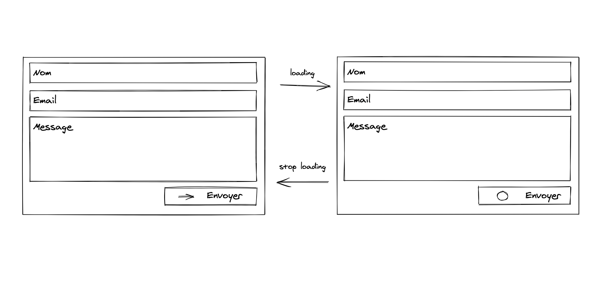
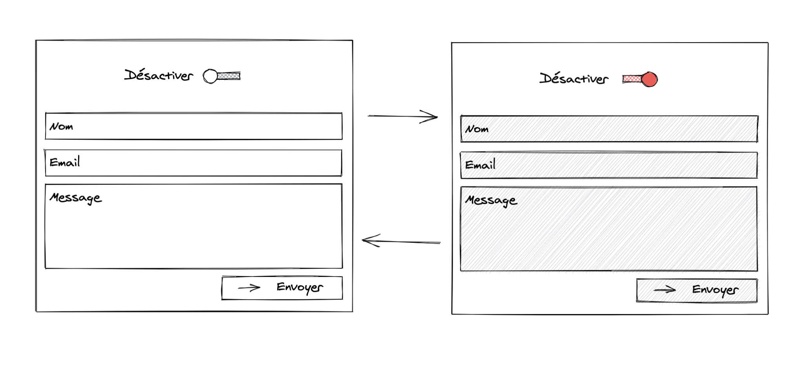

# QUIZZ 3



## 0. Créer votre branche quizz3/[NOM-PRENOM]

## 1. Installer [Material-UI](https://material-ui.com/getting-started/installation/)

## 2. Créer une formulaire

Utiliser le composant TextField pour géer les input.

Utiliser des hooks: *useState* pour gérer les valeurs de chaque champ.
- Gérer les updates via la propriété *onChange*
- Gérer la valeur de l'input via la propriété *value*

Créer une fonction qui log les donnés du formulaire dans une objet.

```javascript
{
  name: '',
  email: '',
  message: ''
}
```

## 3. Bonus

Simuler un appel sur serveur en utilisant la fonction **waitXSeconds** et changer l'icone (en CircularProgress) sur le bouton pendant X seconds.

Note: Transformer la fonction de soumission du formulaire en [fonction Asynchrone](https://developer.mozilla.org/en-US/docs/Web/JavaScript/Reference/Statements/async_function) (async/await)

## 4. Bonus 2



Utiliser le composant *Switch* de Material-UI pour rajouter la possibilité d'activer/désactiver le formulaire. Lorsque le switch est activé tous les champs et le bouton sont disabled.